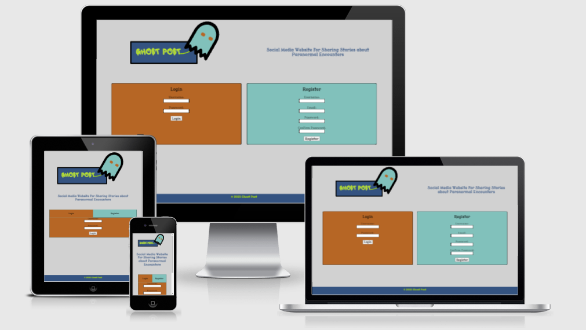

# **Ghost Post Social Media Website**
[View the live project here](https://ghost-post.herokuapp.com/)  
This is the documentation for the Ghost Post social media website project. Ghost Post is a social Media website where users can post stories about their paranormal encounters. Users may also interact with the site in various ways such as following  other users, display information about themselves on their profile page and favorite stories they particularly like. The primary goals of the website are to create a forum for those interested in paranormal activity, to generate a large amount of site users in order to have advertising opportunities and possibly to gather the best stories from the site and put them into a book.

## **Table of Contents**
*  **[Technologies Used](#technologies-used)**
    * [Code](#code)
    * [Languages](#languages)
    * [Frameworks and Libraries](#frameworks-and-libraries)
    * [Validators](#validators)
    * [Other Technologies Used]
*  **[UX Design](#ux-design)**
    * [Strategy Plane](#strategy-plane)
        * [Value Provided to the Business](#value-provided-to-the-business)
        * [Value Provided to the Users](#value-provided-to-the-users)
        * [B2C Considerations](#b2c-considerations)
        * [Cultural Considerations](#cultural-considerations)
        * [Business Objectives](#business-objectives)
        * [User Needs](#user-needs)
        * [Opportunities Table](#opportunities-table)
    * [Scope Plane](#scope-plane)
        * [Site Features](#site-features)
        * [User Stories](#user-stories)
    * [Structure Plane](#structure-plane)
        * [Interaction Design](#interaction-design)
        * [Information Architecture](#information-architecture)
    * [Skeleton Plane](#skeleton-plane)
        * [Project Wireframes](#project-wireframes)
    * [Surface Plane](#surface-plane)
        * [Colour](#colour)
        * [Layout](#layout)
        * [Fonts](#fonts)
        * [Images](#images)
        * [Order and Sequence](#order-and-sequence)
        * [Identity](#identity)
## Technologies used

### **Code**

* VSCode - to write the code for the project
* Git - used for version control 
* Github - software used to store project remotely

### **Languages**

* HTML
* CSS
* JavaScript
* Python

### **External Libraries**

* [Iconify.design](https://iconify.design/)
* JQuery
* Google Fonts
* Flask
* Pymongo
* Werkzeug.security

### **Databases**
* [MongoDB](https://www.mongodb.com/)

### **Validators**
 * [W3Schools HTML validator](https://validator.w3.org/) 
 * [W3Schools Jigsaw CSS validator](http://jigsaw.w3.org/css-validator/validator) 
 * [JSHint JavaScript validator](https://www.jshint.com/)  - The code was validated in using the jshint extension for vscode with the esversion set to esversion 6.

 ### **Other Technologies Used**

 * [Balsamiq](https://balsamiq.com/) - for creating wireframes
 * Chrome developer tools - for testing and inspecting code
 * Lighthouse - for testing performance rating of deployed site
 * [Boxy SVG Editor](https://boxy-svg.com) - for creating brand logo
 * [GIMP](https://www.gimp.org/) - for resizing images
 * responsivedesignchecker.com - for testing site responsivity

[back to contents](#table-of-contents)

## **UX Design**

### **Strategy plane**

The strategy upon which the site is built is based on the business objectives and the user needs.

#### **Value Provided to the Business**

The site provides value to the business in several ways. It allows the business the opportunity to accumulate a large amount of site users. These users can then be targeted with ads relating to paranormal activity such as ads for books, clothes and tv shows. There is also an opportunity for the site owner to curate the best stories that are posted by users on the site and place them into one or more volumes of books.

#### **Value Provided to the Users**

The site as it is currently built provides value to customers in several ways that are detailed below. The site allows users to participate and interact with others with a similar interest in the paranormal and those who claim to have had paranormal encounters. It allows users to upload and share acounts of supernatural encounters they claim to have had.

#### **B2C Considerations**

As the site is a business dealing with customers it is modeled with B2C considerations taken into account. The site uses strong branding with catchy and compelling minimal content to trigger positive emotions in the consumers that would lead them to making a 'purchase'. A purchase in this case can be considered as one of a few actions; those being signing up for the site, making a post and following other users. The branding of this site is both warm and bold to promote the spirit of the community. The images on the site are large and the content is minimal in order. Efforts have been made to ensure that the site navigation is simple and direct. These contribute to the mood of the user while using the site. This is intended to keep the users coming back to the site as well as promoting the site to their friends.

#### **Cultural Considerations**

The site is designed to be used by those in the paranormal community. This means that the site should be very user friendly with large writing and good contrast as some of the members in the community are old.

#### **Business Objectives**

When completing the strategy section of the UX design for the site the business outlined several objectives. The objectives are as follows:

* To amass site users in order to create advertising opportunities on the site in the future
* To create a collection of stories about paranormal encounters.
* To create a means of grading the popularity of the stories with the possibity of collecting the most popular stories into one or more book volumes.
* To register users for the site with a means of informing them about the books existence if it is to be released.
* Create a strong site branding so that users would recommend the site to their friends.
* Develop smaller communities for those interested in particular types of paranormal activity.
* Create a means of contacting individual members of the site
* Add a live messaging feature on the site so that users can communicate directly to one another.
* Display stories in categories

#### **User Needs**

When completing the strategy section of the UX design for the site, several user needs were identified. The needs are as follows:

* To read stories of paranormal encounters.
* To post own accounts of such stories.
* To interact with other members of the community. 
* To save favorite stories.
* To message others in the community.
* To taylor the main feed to personal preference.
* To search for particular types of encounters.
* To create a custom profile to show interests and personality
* To start groups with like minded individuals. 
* To message other users in real time.
* To sort the feed by most popular.
* To edit and delete previous posts. 
* To search for specific posts.
* To follow other users.
* To see a collection of stories from a users profile/have a record of all the posts they themselves have posted.

Using the business goals and user needs a table of opportunities was created and their importance was compared with their viability to decide which opportunities should be pursued.

#### **Opportunities Table**

| **Opportunity**                                                                    | **I** | **V** | **Y/N** | **Reasoning**                                                                                                                                                  |
|------------------------------------------------------------------------------------|-------|-------|---------|----------------------------------------------------------------------------------------------------------------------------------------------------------------|
| Create a method for users to register and log into the site                        | 5     | 5     | Y       | This is absolutely necessary and cannot be omitted.                                                                                                            |
| Create a method for users to upload their stories                                  | 5     | 5     | Y       | This is is part of the site's core funtionality and must be completed.                                                                                         |
| To create a method for users to edit/delete their stories                          | 5     | 5     | Y       | This is once again part of the core functionality.                                                                                                             |
| To create a main 'feed' page.                                                      | 5     | 5     | Y       | This is regarded as being part of the minimal viable product and must be pursued.                                                                              |
| Allow the users to filter the feed by the most popular/oldest and newest stories.  | 5     | 5     | Y       | This is also part of the minimal viable product                                                                                                                |
| Create a method for users to customise their feed.                                 | 3     | 2     | N       | This is somewhat important. However it could be too time consuming to complete in the initial build.                                                           |
| Allow users to save their favorite stories.                                        | 4     | 5     | Y       | This is easily achievable and should be followed through with.                                                                                                 |
| To create a method for users to search for specific posts                          | 5     | 5     | Y       | This is simple to achieve and very important for creating a good user experience.                                                                              |
| Allow users to interact with each other via comments                               | 4     | 1     | N       | Although this is a desirable feature and must be completed in a future build, it is too complicated a feature to complete for the minimal viable product.      |
| To create a means for users to customise their profiles                            | 3     | 4     | Y       | This is not as important as other features in the minimal viable product but should be achievable.                                                             |
| Add a live messaging feature                                                       | 4     | 1     | N       | This is a very difficult feature to implement and should be left out for the current build.                                                                    |
| To create a means for users to follow/unfollow other users                         | 3     | 4     | Y       | This is somewhat important but very easily implemented                                                                                                         |
| Develop a strongt and eye catching branding for the site.                          | 5     | 5     | Y       | This is crucial and should be thought carefully about in order to keep users returning to the site as well as having them recommend the site to their friends. |
| Create a method for users to start groups with other users.                        | 2     | 1     | N       | This is not very important at this stage of development and as it is very difficult to implement it should not be pursued.                                     |
| Collect users emails so that they can be contacted when the book is to be released | 5     | 5     | Y       | This is extremely simple to implement as it can be done when the users are signing up for the site.                                                            |
| **Total**                                                                          | 58    | 53    |         |                                                                                                                                                                |
| **Adjusted total disregarding opportunities to be traded off**                     | 45    | 48    |         |                                                                                                                                                                |

[back to contents](#table-of-contents)

### **Scope Plane**

#### **Site Features**

The features to be included in the site based on the tradeoffs from the strategy plane. They are as follows:

Login and register forms - These will allow the users to register for the site and to log in once they are registered.

A profile creation page - This will allow the users to finish the creation of their profile. The user should not be permitted into the site without completing the tasks from this page. 

A main feed - This will act as home page for the user and they will be presented with the stories that other users have posted.

Feed filter - This feature will be present on any page that displays stories. The filter should allow the user to filter the stories by category and to sort them from newest to oldest and by the number of favorites.

User profile pages - These pages will display the information that users have provided about themselves. It will also contain links to the users followers, following, stories and favorites.

Favorites pages - These pages will contain the favorite stories of a particular user. They will have the same layout as the feed page. 

User stories pages - These pages will contain a list of the stories written by a particular user. They will have the same layout as the feed page. 

Add story page - This page will provide the user to add a story. The form will include details such as title, category, location and content.

Edit profile page - This page will allow the user to edit any previously supplied information that they have given and has been used to create their profile.

Edit story page - This page will allow the user to edit any story that they have written.

Edit/Delete buttons - These buttons should be presented to the user on any story that they have written. The edit button should navigate the user to the edit story page and the delete button should prompt the user if they want to delete the story.

Edit profile button - This button should be present on the user's profile page and should take them to the edit profile page.

Main navigation - The main navigation will contain links to the main feed, the users profile and the add story page. It should also contain a logout button and a search bar.

Navigation for smaller screens - This feature should contain the same functionality as the main navigation but should be hidden in a dropdown accessible on smaller screens. The menu should be accessible through a dropdown icon.

Logout button - This button will be present in the navigation and should log the user out of the site. 

Search bar and search results page - A search bar should be present in the navigation and should return the results of the user's query. These results should be displayed on a search results page. This page should have the same layout as the feed page.

#### **User Stories**

User stories were created to aid in the designing of the site and in testing later on. They are as follows:

* As a new user of the site I want to be able to register and create a profile.
* As a ghosthunter I want to be able to filter the feed to only include stories about ghosts
* As somebody from Albania I want to be able to search for instance of paranormal activity in that country
* As a security conscious individual I want to ensure that I have logged out of the site after pressing the logout button
* As a witness of an angel I want to be able to write an account of this story on the site.
* As a magazine editor I want to be able to read the most popular stories on the site with the possiblity of adding one of them to my magazine.
* As a site user who has recently moved country I want to be able to edit my site profile to reflect this.
* As a sociable individual I want to be able to follow other individuals on the site.
* As a person suffering from amnesia I want to be able to edit a previous post to include newly remember details. 
* As a regular site user I want to be able to favorite any new stories that I read and enjoy.
* As somebody who has recently discovered their encounter was just a practical joke I want to be able to remove the encounter.
* As a long time user of the site I want to be able to view the oldest posts on the site.

[back to contents](#table-of-contents)

### **Structure Plane** 

#### **Interaction Design**

1. Consistency - The site should remain consitant across all pages. This includes the following.
    * The navbar will remain at the top of the page and the footer at the bottom. 
    * There will be a burger icon on all pages instead of a nav-bar on smaller screen sizes. 
    * Styling will also remain consitant across all pages.
2. Predictablity -
    * All links will take the user to expected locations.
    * Clicking on the logo will take the user back to the home page as is convention. 
3. Learnability -
    * There will be active links on the navbar so that the user will know what page they are on. 
    * Pages with the same function will have the same layout to provide the user with a better sense of place and navigational possibilities. 
4. Visibility -
    * When possible as much page content for each page will be visible on each page. 
    * In situations where the content exceeds that of the screen size content hinting will be used. 
5. Feedback - There will be clear and consistant feedback given to site users -
    * Buttons that link the user to other locations will highlight when the mouse is over them.
    * For links and other clickable items the cursor will change to a pointer. 
    * Flash messages will appear to inform the user that their actions were successful

#### **Information Architecture**

The site operates using a traditional navigational system with a navbar at the top of the page. The main pages of the site are the feed, profile and add story page. The links to other pages on the stie branch out from these pages. The site also uses a search function so that the user may search for particular stories that they are interested in. Finally there is a number navigation system such as that seen on the bottom of search engines pages that the user can click to take them to the desired page of results.

[back to contents](#table-of-contents)

### **Skeleton Plane**

The site uses icons as metaphors. Examples of these include the left and right arrows as well as the burger icon which represents represents a menu dropping down for the navbar on small screens. The information on the site will be displayed in order of importance. An example of this is the feed page on smaller screens. The filter is not seen unless the user clicks on the button. This is because the stories in the feed are more important. Content on the site will be well spaced and will be easy to read with good colour contrast. This is good information design.

#### **Project Wireframes**

[Add/edit story page on mobile](resources/wireframes/add-story-page-small-screen.png)  
[Add/edit story page on tablet](resources/wireframes/add-story-page-medium-screen.png)  
[Add/edit story page on desktop](resources/wireframes/add-story-page-large-screen.png)  
[Feed/user stories/favorites/search results page on mobile](resources/wireframes/feed-page-small-screen.png)  
[Feed/user stories/favorites/search results  page on tablet](resources/wireframes/feed-page-medium-screen.png)  
[Feed/user stories/favorites/search results  page on desktop](resources/wireframes/feed-page-large-screen.png)  
[Following page on mobile](resources/wireframes/following-page-small-screen.png)  
[Following on tablet](resources/wireframes/following-page-medium-screen.png)  
[Following on desktop](resources/wireframes/following-page-large-screen.png)  
[Login page on mobile](resources/wireframes/login-page-small-screen.png)  
[Login on tablet](resources/wireframes/login-page-medium-screen.png)  
[Login on desktop](resources/wireframes/login-page-large-screen.png)  
[Finish/edit profile page on mobile](resources/wireframes/profile-creation-page-small-screen.png)  
[Finish/edit profile page on tablet](resources/wireframes/profile-creation-page-medium-screen.png)  
[Finish/edit profile page on desktop](resources/wireframes/profile-page-large-screen.png)  
[Profile page on mobile](resources/wireframes/profile-page-small-screen.png)  
[Profile page on tablet](resources/wireframes/profile-page-medium-screen.png)  
[Profile page on desktop](resources/wireframes/profile-creation-page-large-screen.png)  

[back to contents](#table-of-contents)

### **Surface Plane**

 

Below are the surface plane considerations that were made for the site
  

#### **Colour**

The colours chosen for the site are minimal. Only the three main colours from the site logo are used. Otherwise shades of black and white are applied.This is to give the site a modern feel.  

#### **Layout**

The site  attempts to create elements from the same sections aligned linearly to help in defining where sections begin and end for the user. The site uses changes of color in the navbar and footer to define sections. The site also uses borders and boxes to define which elements belong to particular sections.   

#### **Fonts**

The fonts chosen for the site are the fonts 'Modern Antiqua' and 'Lacquer'. 'Modern Antiqua' is a clean font and is inspired by the font sometimes used in old story books. Lacquer is part of the site branding and appears in the logo. It is a creepier font used to compliment the site's theme of the paranormal  

#### **Images**

The icons used on the site will be chosen according to how recognisable they are. The profile pictures were chosen due to how eye catching they were. The logo is created to be memorable yet simple.   

#### **Order and Sequence**

The most important elements on the site are the most easily recognized. An example of this is the navbar which seems to trail out of the sites eye-catching logo at the top of the page. The first link in the navbar is the to the add story page. This design is intentional and is to encourage users to post stories.   

#### **Identity**

The surface plane decisions in this site combine to create a clean modern look which incorporates elements of the paranormal seen through the fonts and colours for example. This combination is intended to portray the brand as being openminded to both the world as is known as well as unknown.   

---

## **Testing**

### **Code Validation**

* The HTML in this project was validated using the W3C code validation service. [W3C Markup Validation Service](https://validator.w3.org/) 

* The CSS in this project was validated using the W3C CSS Code Validation Service [W3C CSS Markup Validation Service](http://jigsaw.w3.org/css-validator/validator) 

* The Javascript in this Project was validated using the JSHint.com validator [JSHint Javscript Validator](https://jshint.com/)

* The python code in this project is styled consistently and conforms to the PEP8 style guide

[back to contents](#table-of-contents)

### **Feature Testing**

**Login and Register Forms**

Expected: The register form should record the user's desired user name and email. If the user name is already taken a flash message should appear stating this to the user. The user should also not be able to log in unless the passwords in both fields match. If the passwords do not match a message should appear stating this to the user. Once the user has filled the form out with a unique username and matching password they should be taken to the finish profile page. The users name, email and password should appear on the database. There should also be a finished profile variable in the users data set to false. If the user enters and incorrect name or password while using the login form a flash message should appear stating this to the user. If the user has completed their profile they should be taken to the main feed. Otherwise, they should be taken to the finish profile page.

Result: The feature functions as expected. The flash messages appear as they are supposed to. Once the user completes the register form the details they enter appear correctly in the database. Both forms function as intended and bring the user to the relevant page depending on whether they have completed their profile or not.

**Profile Creation Page/ Finish Profile Page**

Expected: The user should be presented with a form which requires them to enter their main interest relating to the paranormal, their locaton and a textarea where they can give some information about themselves. They must also choose an avatar from a carousel of images that is presented to them. When the user has filled out the form fully and submitted it they should be taken to the feed page. The data they have provided should be updated on their profile on the database. The 'finished profile' variable should be set to True now as they have completed their profile.

Result: The page functions as designed. The user must fill out all the fields in the form before the submit button works. They are then navigated to the feed page. The data is updated on their profile on the database. The 'finished profile' is set to True on inspection.

**Main Feed Page**

Expected: The user should be greeted with a welcome message which includes their name. There should be stories preview boxes on the feed which include the story title, location, category and preview of the content of the story. There should also be the avatar and name of the user below this information with the number of favorites the story has and a button which gives the user the option to view the story in full. The avatar should be clickable and should take the user to the story author's profile. The view story button should take the user to a page where the full content of the story is visible. At the bottom of the feed there should be a number navigation system. It should provide feedback to the user informing them what page they are on. The user should be able to click the numbers to navigate to another of the pages.

Result: The user is greeted with the message as designed. The story preview boxes contain the correct information. The user can click the avatar to visit the author's profile. The view story button takes the user to a full version of the story. The number of favorites that the story has are also visible. The number navigation system at the bottom of the page takes the user to the correct page when a number/Next/Prev is clicked. The current page is highlighted through a change in color and underlining of the page number.

**Feed Filter**

Expected: The user should be able to filter the stories in the feed by using the category checkboxes. If the user clicks the 'all' checkbox the other checkboxes should be impossible to click. There should be a dropdown from which the user can sort the feed by oldest, newest and most favorites. Pressing the go button should filter the feed based on the user's choices. If the user has used the filter and uses the number navigation at the bottom of the page, their filter choices should remain intact. 

Result: Using the checkboxes makes it possible to include or exclude any of the categories that they wish to. The dropdown menu makes it possible to sort the feed in the manner described above. Upon clicking the 'all' checkbox the other checkboxes are placed under a dark filter. The cursor also changes to 'not-allowed'. Using the navigation at the bottom of the screen has no affect on the users filter choices and they are presented with the desired page with the filter choices still applied.

**User Profile Pages**

Expected: The user profile pages should present the details that the user gave in the register form and the finish profile page apart from the email they provided and their password. The users avatar should also be visible. There should be icons present on the screen which navigate the user to the favorites, stories, followers and following of the user whose profile they are viewing. There should be also a button present which allows the site user to follow the profile owner or to unfollow them if they are already following them. Using these buttons should refresh the page and a flash message should provide the site user with confirmation of the action they have taken.

Result: The information on the page includes the users name, main interest, location and about information. The user's avatar is also visible. All the icon links on the page work correctly and navigate the site user to the correct pages. The follow/unfollow buttons work correctly and flash messages appear reflecting the action that the user has taken.

**User Story Pages**

Expected: These pages should be contain the same layout as the feed page with both the story preview boxes and feed filter present. The page is accessed from the icon on a particular user's profile page. The stories on the page should belong solely to that user. The filter and navigation should function the same as on the feed page.

Result. The page is layed out exactly the same as the feed page with all features present. The page is accessed only from the icon on a users profile. The author of the stories on the page is correct. The filter and navigation function correctly.

**Add Story Page**

Expected: This page should be accessible through the link in the navbar. Either on small or large screens. The page should contain a form which allows the user to post a story. The details of the story should be the name, location and content. When the user posts the story it should appear as the newest story on the feed page. The story should be added on the database with the date of posting and the details that the user has provided.

Result: The page is accessed from the links in the navbars. The page contains a form with the correct fields. The user must complete all fields before it is possible to submit the story. Upon submission the story appears as the first entry on the main feed and the story is added to the database with the date and details.

**Edit Profile Page**

Expected: This page should be accessible from the user's own profile page. An edit button should appear on the profile page which takes them to this page when clicked. The edit profile page should give the user to update their email, interest, avatar, location and about information. Upon submitting the form the details should be updated on the database.

Result: The edit profile button takes the user to this page from their profile page. The form gives the user to update the correct details. Upon submitting the form the user's details are updated on the database.

**Edit story page**

Expected: This page should be accessible from the edit buttons on any story they have written either on story preview boxes or the view story page. The form on the edit story page should give the user the opportunity to update the content, location, category and name of the story that they have written. Upon submitting the form the details should update on the database.

Result: The page is accessible from the edit story buttons. The form contains the correct fields. The user must fill out all fields in the form form submission to work. The story details update on the database when the user submits the form. 

**Edit/Delete buttons**

Expected: These buttons should appear only on story preview boxes of stories that have been written by the site user or the view story pages of these stories. The edit story buttons should take the user to the edit story page. Upon clicking the delete story button the user should be prompted with a javascript alert whether or not they want to proceed with the deletion of the particular story. If the user chooses to proceed the user should be navigated back to the main feed and they should be flashed a confirmation message that the story has been deleted. The story should be completely removed from the database.

Result: The buttons are only present on stories that the user has themselves written. The edit story button takes the user to the edit story page. The delete story button raises an alert which requests confirmation. The user may choose to cancel or proceed at this point. If the user chooses to proceed, they are taken back to the feed page and the correct flash message appears. The story is removed from record on the database.

**Edit profile button**

Expected: This button should only appear on the user's own profile page. It should navigate the user to the edit profile page.

Result: The button is only present on the user's own profile and does not appear on other user's profiles. The button redirects the user to the correct location

**Main navigation**

Expected: This navigation should contain links to the feed, profile and add story pages. It should also contain a logout button and a search bar. The logout and search bar have been documented as separate features beneath this one. If the user is currently viewing one of the pages which are linked in the navbar there should be a line under the correct link. 

Result: The navigation contains the correct items and the links direct the user to the correct locations. As the user navigates to the pages linked in the navbar, the links are underlined to reflect the current page as intended.

**Navigation for smaller screens**

Expected: The navigation for the smaller screen should function exactly the same as the large screen navigation. However the navigation on the smaller screens should be hidden initially and accessible as a dropdown from a dropdown icon. The menu should also be closeable using an x icon located at the top of the dropdown.

Result: The navbar functions in the same manner as that of the navigation on larger screens. Both the dropdown icon and x icon function correctly in opening and closing the dropdown navigation.

**Logout button**

Expected: Upon clicking the button the user should be navigated back to the login page. The user should be presented with a flash message with confirmation that they have logged out. If the user tries to access a page from the site via url they should be presented with a page that informs them that they are not logged in. 

Result: The button navigates the user back to the login page and the flash message appears confirming that they have logged out. If the user attempts to navigate to another page on the site via url the correct 'not logged in' page appears.

**Search bar and search results page**

Expected: The search bar should be present in the navbars for the small and larger screen sizes. The user should be able to type their query in the text box and submit the search by either clicking the search icon or by pressing enter. The stories which contain the words in the search bar should be returned on a page that has the same functionality as the feed page. If the search returns no results the user should be informed that the search returned no results with a flash message.

Result: The search bar is present in the correct locations on the site. If the search does not return any results, the user is informed of this with a flash message. When the search returns results, it returns results with the words from the search bar. The results are displayed on a page with the same functionality as the feed page with both the feed filter and number navigation present.

### **User Story Testing**

#### **User Story 1**

Expectation: As a new user of the site I want to be able to register and create a profile.

Test result: On opening the login page to the site the user is presented with both the login and register forms. As the user does not currently have an account it is obvious to them that they need to fill in the register form. The user fills in the form. However the first username that they choose ('Funky') has already been taken. They are informed of this through a flash message. The user then chooses the name 'Groovy'. The user is able to create an account. They are then directed to the finish profile page. The user fills out the form on the page. It is obvious what to place inside the fields due to the input titles. The user presses the submit button. They are then directed to the feed page where they are greeted with a personalised message including their username. They are also presented with a flash message stating that their registration was successful. It is obvious to the user that they have been successful in creating a new profile.

Analysis: The user's expectation has been met

[screenshot 1 of user story](resources/user-story-testing-images/user-story-1-a.PNG)

[screenshot 2 of user story](resources/user-story-testing-images/user-story-1-b.PNG)

[screenshot 3 of user story](resources/user-story-testing-images/user-story-1-c.PNG)

#### **User Story 2**

Expectation: As a ghosthunter I want to be able to filter the feed to only include stories about ghosts.

Test result: The user accesses the feed page through the navbar feed link. The user sees the filter on the left side of the page. The user deselects the all checkbox. The dark filter disappears from in front of the other checkboxes. The user deselects all the checkboxes except for ghosts the user clicks the go button on the filter. The feed is refreshed and only includes stories about ghosts.

Analysis: The user's expectation has been met

[screenshot 1 of user story](resources/user-story-testing-images/user-story-2-a.PNG)

[screenshot 2 of user story](resources/user-story-testing-images/user-story-2-b.PNG)

[screenshot 3 of user story](resources/user-story-testing-images/user-story-2-c.PNG)

#### **User Story 3**

Expectation: As somebody from Albania I want to be able to search for instance of paranormal activity in that country.

Test result: From the feed page the user questions whether they can use the filter to filter by country. They quickly realise that this is not possible. They then use the search bar in the nav to search for 'Albania'. The user clicks the search icon. The user is then presented with a search results page which only includes posts that are located in Albania.

Analysis: The user's expectation has been met. However it might be a good idea to include a country filter in the feed filter in a future release.

[screenshot 1 of user story](resources/user-story-testing-images/user-story-3-a.PNG)

[screenshot 2 of user story](resources/user-story-testing-images/user-story-3-b.PNG)

#### **User Story 4**

Expectation: As a security conscious individual I want to ensure that I have logged out of the site after pressing the logout button.

Test result: The user uses the site navigation to logout by pressing the logout button. The user is then navigated to the login page. A flash message appears and informs them that they are logged out. However the user wants to make sure they are logged out and types '/feed' in the as a url. The user is presented with a page telling them that they are no longer logged in to the site.

Analysis: The user's expectation has been met

[screenshot 1 of user story](resources/user-story-testing-images/user-story-4-a.PNG)

[screenshot 2 of user story](resources/user-story-testing-images/user-story-4-b.PNG)

[screenshot 3 of user story](resources/user-story-testing-images/user-story-4-c.PNG)

#### **User Story 5**

Expectation: As a witness of an angel I want to be able to write an account of this story on the site.

Test result: The user navigates to the add story page using the navbar link. The user is presented with a form that allows them to fill in the details of their encounter. The user fills in all fields in the form and clicks the submit button. The user is redirected back to the feed page where they a flash message appears telling them that they have added their story successfully and they see their story at the top of the feed.

Analysis: The user's expectation has been met

[screenshot 1 of user story](resources/user-story-testing-images/user-story-5-a.PNG)

[screenshot 2 of user story](resources/user-story-testing-images/user-story-5-b.PNG)

[screenshot 3 of user story](resources/user-story-testing-images/user-story-5-c.PNG)

#### **User Story 6**

Expectation: As a magazine editor I want to be able to read the most popular stories on the site with the possiblity of adding one of them to my magazine.

Test result: From the feed page the user sees the filter at the left hand side of the screen. The user uses the drop down sort method to sort the stories by number of favorites. The user's feed is then filtered with the stories with the most number of favorites at the top. The user clicks the 'view story' button to read the stories at the top of the feed.

Analysis: The user's expectation has been met

[screenshot 1 of user story](resources/user-story-testing-images/user-story-6-a.PNG)

[screenshot 2 of user story](resources/user-story-testing-images/user-story-6-b.PNG)

[screenshot 3 of user story](resources/user-story-testing-images/user-story-6-c.PNG)

#### **User Story 7**

Expectation: As a site user who has recently moved country I want to be able to edit my site profile to reflect this.

Test result: The site user navigates to their profile page using the link in the navbar. The user is presented with an 'edit profile' button under the main heading on their profile page. The user clicks this button. They are taken to the edit profile page. The user uses the location dropdown to change their country to Greece. The user clicks the submit button. They are redirected back to their profile page and see that their location has been updated.

Analysis: The user's expectation has been met

[screenshot 1 of user story](resources/user-story-testing-images/user-story-7-a.PNG)

[screenshot 2 of user story](resources/user-story-testing-images/user-story-7-b.PNG)

[screenshot 3 of user story](resources/user-story-testing-images/user-story-7-c.PNG)

[screenshot 4 of user story](resources/user-story-testing-images/user-story-7-d.PNG)

#### **User Story 8**

Expectation: As a sociable individual I want to be able to follow other individuals on the site.

Test result: The site user sees another user's avatar in a story preview box on the feed. The user hovers over the avatar. The avatar highlights and the cursor changes to a pointer. The user is aware that they can click on the avatar. The user does so and is taken to that users profile page. On the profile page the user sees a message that they are not following the other user along with a button that gives them the option to follow that user. The user clicks the button. The page refreshes. The user is presented with a flash message with tells them they are following the other user. The message beside the follow button now says to the user that they are following the other user and the button has changed to say 'unfollow'

Analysis: The user's expectation has been met

[screenshot 1 of user story](resources/user-story-testing-images/user-story-8-a.PNG)

[screenshot 2 of user story](resources/user-story-testing-images/user-story-8-b.PNG)

[screenshot 3 of user story](resources/user-story-testing-images/user-story-8-c.PNG)

#### **User Story 9**

Expectation: As a person suffering from amnesia I want to be able to edit a previous post to include newly remember details.

Test result: The user navigates to their profile page and clicks the icon for their own stories. The user is taken to a page which dispalys all the stories that they have written. They user clicks the edit story button for the story that they want to change. The user is brought to the edit story page. The user adds an extra detail in the content section of the form an clicks submit. The user is redirected to their feed and a flash message appears indicating to them that they have successfully edited their previous post.

Analysis: The user's expectation has been met

[screenshot 1 of user story](resources/user-story-testing-images/user-story-9-a.PNG)

[screenshot 2 of user story](resources/user-story-testing-images/user-story-9-b.PNG)

[screenshot 3 of user story](resources/user-story-testing-images/user-story-9-c.PNG)

[screenshot 4 of user story](resources/user-story-testing-images/user-story-9-c.PNG)

#### **User Story 10**

Expectation: As a regular site user I want to be able to favorite any new stories that I read and enjoy.

Test result: The user navigates to the feed using the dropdown menu on their mobile. The user reads the top post. However it doesn't seem interesting to them. The user reads the second post. They click the view story button to read the story further. The user reads the story in full on the view story page and enjoys the story. The user sees the button with the option to favorite the story. The user clicks the button. The page refreshes. The user is displayed a flash message letting them know that the story has been added to favorites. The user can also see that the story's favorite count has increased by 1.

Analysis: The user's expectation has been met

[screenshot 1 of user story](resources/user-story-testing-images/user-story-10-a.PNG)

[screenshot 2 of user story](resources/user-story-testing-images/user-story-10-b.PNG)

[screenshot 3 of user story](resources/user-story-testing-images/user-story-10-c.PNG)

[screenshot 4 of user story](resources/user-story-testing-images/user-story-10-d.PNG)

#### **User Story 11**

Expectation: As somebody who has recently discovered their encounter was just a practical joke I want to be able to remove the encounter.

Test result: The user locates their story from the user stories page which they access from their profile page. The user clicks the delete button on the story that they want to delete. The user sees an alert which asks them if they are sure that they want to delete the story. The user confirms that they want to delete the story. The user is redirected back to their main feed page. A flash message is displayed to them telling them that they have successfully deleted their story.

Analysis: The user's expectation has been met

[screenshot 1 of user story](resources/user-story-testing-images/user-story-11-a.PNG)

[screenshot 2 of user story](resources/user-story-testing-images/user-story-11-b.PNG)

[screenshot 3 of user story](resources/user-story-testing-images/user-story-11-c.PNG)

[screenshot 4 of user story](resources/user-story-testing-images/user-story-11-d.PNG)

#### **User Story 12**

Expectation: As a long time user of the site I want to be able to view the oldest posts on the site.

Test result: The user clicks the filter dropdown on the mobile version of the site. The filter appears on the feed page. The user uses the sort method dropdown to select the oldest stories. The user clicks go on the filter. The page refreshes and now has the oldest stories appearing first.

Analysis: The user's expectation has been met

[screenshot 1 of user story](resources/user-story-testing-images/user-story-12-a.PNG)

[screenshot 2 of user story](resources/user-story-testing-images/user-story-12-b.PNG)

[screenshot 3 of user story](resources/user-story-testing-images/user-story-12-c.PNG)

## **Bugs and Issues**

### **Known Issues**

* There was a warning present in the code validation relating to the flash message container being empty. However, it was necessary to leave this heading in place on all pages as the flash script relies on it being present. Leaving the container in was necessary to avoid console errors.

* The developer is also aware of a possible issue that may occur with loading times once many stories are added to the site. As it stands the site loads all the stories when the feed is opened. This is not ideal as once there are many stories the loading time may be significantly increased. In the next build the developer will solve this by using a pymongo function to count the number of entries in the database and only loading the entries 5 at a time using a for loop.

[back to contents](#table-of-contents)

### **Bugs Encountered and Fixes**

#### **Bug 1**

Bug: There was an issue with the small screen nav not fully disappearing when the user resized the screen to the larger screen size.

Fix: The developer could not pinpoint the exact source of this bug but was able to solve the bug using a media query in javascript rather than in css. 

[Screenshot of bug](resources/bugs/bug-1.PNG)

#### **Bug 2**

Bug: There was an issue with the profile images not correctly loading on the feed page. The console read failed to load resource.

Fix: The developer compared the images that were working with those that were not and discovered that there was a '/' missing at the start of the image address. This was coming from the finish profile part of the app. When the user selected their avatar the address was put into the server. The developer changed the code to include the '/' and this solved the issue.

[Screenshot of bug](resources/bugs/bug-2.PNG)

#### **Bug 3**
Bug: There was an issue with using the flex wrap property for the login page flexbox so that 
Fix: The developer is aware that there are certain procedures that can be followed to post forms without the page refreshing such as using the ajax api. However, in the end due to the time constraints of the project the developer felt it was necessary to leave this feature out completely and only include the follow button on user profile pages where refreshing the page interfered less with the flow of the site.

[Screenshot of bug](resources/bugs/bug-3.PNG)

## **Future Features**

### **Location Filter Option**
In a future build the developer intends to add the option to filter the stories in the feed by location rather than to have the user search specifically for the location using the search bar.

### **Messaging Features**

It will be imperative in a future build to allow users to message each other. This is extremely important as a social media site relies on users being able to communicate with each other.

### **Groups**

The user intends to allow users to create groups for those with particular paranormal interests. 

### **Automatically Taylored Feeds**

The developer wishes to add this feature in a future build. This feature would allow users to have the filter options applied to their feed automatically through settings on their profile rather than using the filter every time.

[back to contents](#table-of-contents)

## **Deployment**

### **Heroku Deployment**
The project was deployed to GitHub Pages using the following steps...

1. Create a heroku account on heroku.com
2. Create a new app on Heroku with a unique name.
3. Select the European server if you are located closer to Europe or the United States server if you are closer to the United States.
4. In your IDE console type pip3 freeze -- local > requirements.txt. This creates a text file that heroku needs which includes the requirements needed for the project such as flask and pymongo.
5. Create a Procfile in your IDE By typing python app.py > Procfile in your console.
6. In Heroku you need to set up your config vars. These are located in the env.py file. They are as follows IP, PORT, SECRET_KEY, MONGO_URI and MONGO_DBNAME.
7. In Heroku navigate to settings and click reveal config vars. Copy the config vars outlined above to Heroku and save them.
8. In the deploy link in Heroku navigate to automatic deployment. Click on deploy from github. Use the text box provided to input your url from github and click to enable automatic deployment.
9. Commit your changes and push them to Github
10. The project will now be automatically deployed to Heroku. 
11. In Heroku click on open app. 
12. The URL for the website will be in the address bar.

[back to contents](#table-of-contents)

### **Forking the GitHub Repository**
By forking the GitHub Repository we make a copy of the original repository on our GitHub account to view and/or make changes without affecting the original repository by using the following steps...

1. Log in to GitHub and locate the GitHub Repository
2. At the top of the Repository (not top of page) just above the "Settings" Button on the menu, locate the "Fork" Button.
You should now have a copy of the original repository in your GitHub account.

[back to contents](#table-of-contents)

## **Making a Local Clone**
1. Log in to GitHub and locate the GitHub Repository
Under the repository name, click "Clone or download".
2. To clone the repository using HTTPS, under "Clone with HTTPS", copy the link.
3. Open Git Bash
4. Change the current working directory to the location where you want the cloned directory to be made.
Type git clone, and then paste the URL you copied in Step 3.
$ git clone https://github.com/j-j-jack/ms3-ghost-post
Press Enter. Your local clone will be created.

$ git clone https://github.com/j-j-jack/ms3-ghost-post
> Cloning into `ghost-post-clone`...
> remote: Counting objects: 10, done.
> remote: Compressing objects: 100% (8/8), done.
> remove: Total 10 (delta 1), reused 10 (delta 1)
> Unpacking objects: 100% (10/10), done.

[back to contents](#table-of-contents)

## **References**

**Images**

* Photo by Mads Schmidt Rasmussen on Unsplash
* Photo by Alice Alinari on Unsplash
* Photo by David Balev on Unsplash
* Photo by Marek Studzinski on Unsplash
* Photo by Alessio Zaccaria on Unsplash
* Photo by laura adai on Unsplash
* Photo by Miguel Gonzalez on Unsplash
* Photo by Jaroslav Devia on Unsplash
* Photo by Mahdi Bafande on Unsplash
* Photo by benjamin lehman on Unsplash
* Photo by Kevin Escate on Unsplash
* Photo by Camila Quintero Franco on Unsplash

**Site icons**
* The icons for the site are from [Iconify.design](https://iconify.design/)

**List of Countries**
The list of countries used in the location dropdowns was sourced from [dzone.com](https://dzone.com/articles/list-of-all-countries-in-json)

